# Sumário

1. Introduão \vspace{0.6cm}

3. Material e Métodos \vspace{0.6cm}

4. Resultados e Discussões \vspace{0.6cm}

# Introdução

- Marketing Bancário

\hspace{2cm}

- Objetivo
    - Modelar uma regressão logística a fim de predizer se potenciais clientes assinarão ou não com o banco.

# Ferramentas e Métodos

\center

- _age_: idade do cliente - numérica; 
    
- _job_: emprego do cliente - nominal; 

- _marital_: estado civil do cliente - nominal; 

- _education_: nível educacional do cliente - nominal; 
    
- _default_: cliente possui crédito - binária; 

- _balance_: balanço anual médio do cliente em euro - numérica;

- _housing_: cliente possui empréstimo habitacional - binária; 

- _loan_: cliente possui empréstimo pessoal - binária; 

- _contact_: forma de contato com o cliente - nominal; 

- _day_: dia do mês - numérica; 

- _month_: mês do ano - nominal; 

- _duration_: duração do último contato com o cliente - numérica; 

- _campaing_: número de contatos feitos com o cliente - numérica; 

- _pdays_: número de dias desde o último contato feito com o cliente - numérica; 

# Material e Métodos

- Ajuste do modelo GLM da família binomial para resposta binária com as funções de ligação _logito_, _probito_,           _complemento log-log_ ( _clog-log_ ) e _cauchit_; \vspace{0.4cm}
    
- Seleção por métodos computacionais; \vspace{0.4cm}

- Algorítmo de redução de níveis para ajuste de variáveis categóricas baseado nas idéias de _Tutz(2013)_; \vspace{0.4cm}

- Avaliação do poder preditivo do modelo;

# Resultados e Discussões

\center

__SELEÇÃO POR MÉTODOS COMPUTACIONAIS__

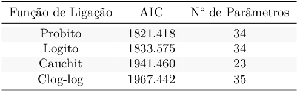{width=250px}

# Resultados e Discussões
\center

__REAGRUPAMENTO DE NÍVEIS - VARIÁVEL MONTH__ 

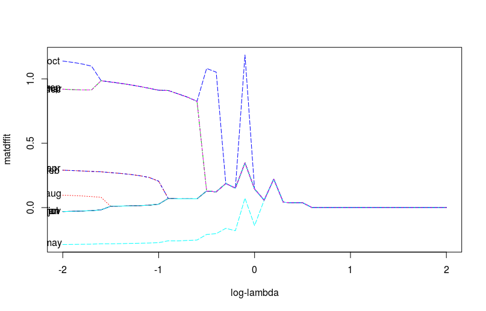{width=280px}

# Resultados e Discussões
\center

__REAGRUPAMENTO DE NÍVEIS - VARIÁVEL JOB__ 

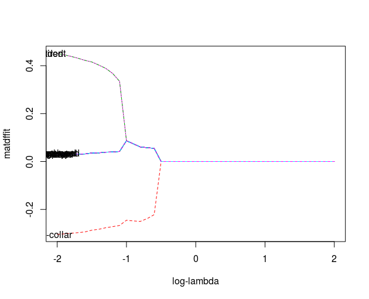{width=280px}

# Resultados e Discussões
\center

__REAGRUPAMENTO VARIÁVEL MONTH__ $\boldsymbol{\lambda}$ __= 0.165__

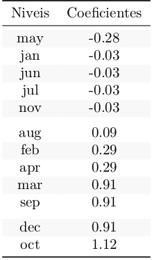

# Resultados e Discussões
\center

__REAGRUPAMENTO VARIÁVEL JOB__ $\boldsymbol{\lambda}$ __= 0.086__

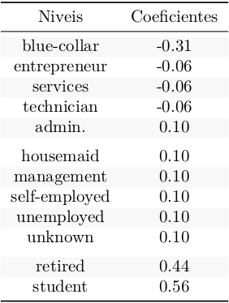

# Resultados e Discussões

\center

__COMPARAÇÃO DE NOVOS AJUSTES__

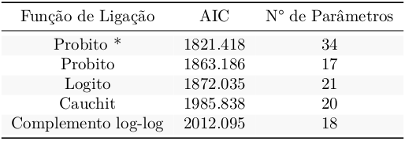{width=300px}

# Resultados e Discussões

\center

__COEFICIENTES E ERROS PADRÕES__

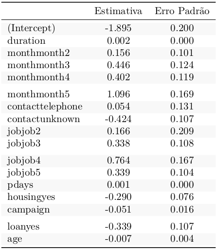

# Resultados e Discussões

\center

__EQUAÇÃO DO MODELO AJUSTADO__

\vspace{1.5cm}

$\boldsymbol{\Phi}^{-1}(\pi_{i}) = \hat{\beta}_0 + \hat{\beta}_1x_{1} + \hat{\beta}_2x_{2} + \hat{\beta}_3x_{3} + \hat{\beta}_4x_{4} + \hat{\beta}_5x_{5} + \hat{\beta}_6x_{6} + \hat{\beta}_7x_{7} + \hat{\beta}_8x_{8} +$

$\hspace{3cm} \hat{\beta}_9x_{9} + \hat{\beta}_{10}x_{10} + \hat{\beta}_{11}x_{11} + \hat{\beta}_{12}x_{12} + \hat{\beta}_{13}x_{13} +$

$\hspace{3cm} \hat{\beta}_{14}x_{14} + \hat{\beta}_{15}x_{15} + \hat{\beta}_{16}x_{16} + \hat{\beta}_{17}x_{17}$

# Resultados e Discussões
\center

__GRÁFICOS DE EFEITO DAS COVARIÁVEIS NO PREDITOR__

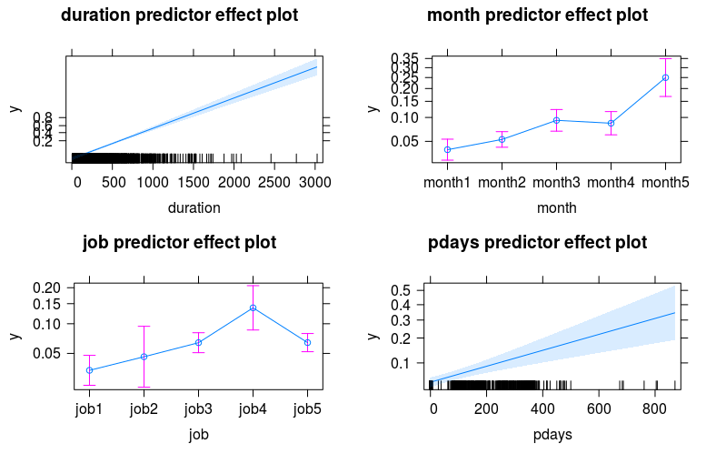{width=320px}

# Resultados e Discussões
\center

__GRÁFICOS DE EFEITO DAS COVARIÁVEIS NO PREDITOR__

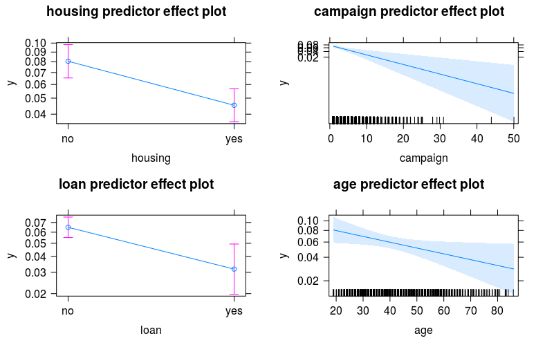{width=320px}

# Resultados e Discussões
\center

__TABELAS DE COMPARAÇÃO__

__PONTO DE CORTE - 0.5__

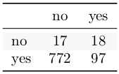{width=80px}

__PONTO DE CORTE - 0.89__

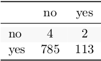{width=80px}

__PONTO DE CORTE - 0.3__

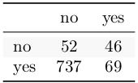{width=80px}

# Resultados e Discussões
\center

__COMPARATIVO DE SENSIBILIDADE E ESPECIFICIDADE__

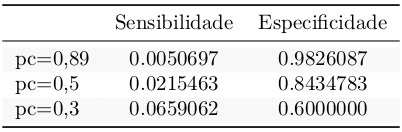{width=300px}

# Resultados e Discussões

\center

__CURVA ROC__

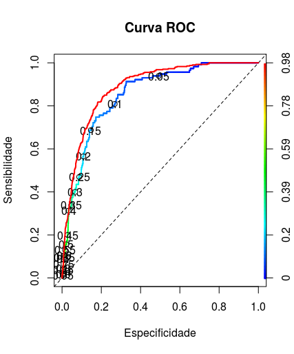{width=300px}

# Resultados e Discussões

\center

__REGRA DE DECISÃO INCORPORANDO CUSTOS__

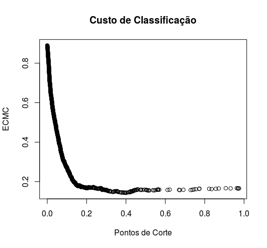

#
